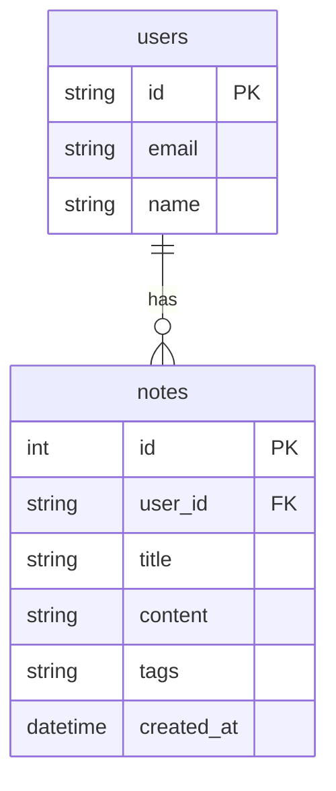
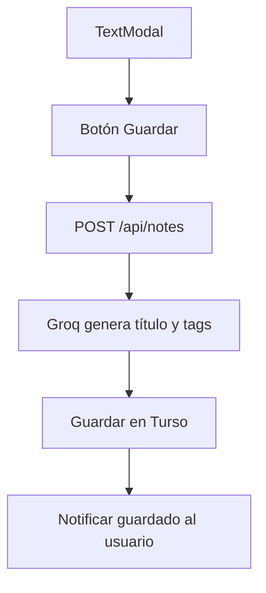

# Project architecture: Aplicación de notas de voz con IA

## 1. Diagrama de arquitectura del sistema

```mermaid
graph TD
  subgraph Cliente (SPA Astro)
    A1[UI: Pantalla de Grabación]
    A2[UI: Modal de Edición]
    A3[UI: Dashboard de Notas]
    A4[Audio Recorder]
    A5[Auth (Better-Auth)]
  end

  subgraph Servidor (Astro API Routes)
    B1[/api/transcribe]
    B2[/api/notes]
    B3[/api/notes (GET)]
    B4[Auth handler]
  end

  subgraph Servicios Externos
    C1[Groq API]
    C2[Turso (SQLite)]
    C3[GitHub Auth]
  end

  A1 --> A4 --> B1 --> C1 --> B1 --> A2
  A2 --> B2 --> C1
  B2 --> C2
  A3 --> B3 --> C2
  A5 --> B4 --> C3
```

## 2. Flujo de datos principal paso a paso

1. Usuario accede a la app y se autentica (Better-Auth + GitHub/email).
2. En la pantalla de grabación:

   * Se inicia la grabación en el navegador con límite de 2 minutos.
   * Se muestra la onda de audio y el contador.
3. Al finalizar la grabación:

   * El audio se puede reproducir/descargar localmente.
   * El usuario lo envía para transcripción (`/api/transcribe`).
4. El endpoint procesa el audio y llama a Groq API para obtener texto.
5. El texto transcrito se muestra en un modal editable.
6. Al guardar:

   * El texto se envía a `/api/notes`.
   * Se solicita a Groq un título y tags.
   * La nota se guarda en Turso (SQLite).
7. En el Dashboard:

   * Se listan las notas desde `/api/notes` (GET).
   * Hay filtros por texto, tags y fecha.

## 3. Esquema visual de la base de datos



## 4. Mapeo de endpoints y APIs

| Método | Ruta            | Descripción                                   | Protegida | Parámetros            |
| ------ | --------------- | --------------------------------------------- | --------- | --------------------- |
| POST   | /api/transcribe | Recibe audio, devuelve transcripción de texto | Sí        | FormData: audio blob  |
| POST   | /api/notes      | Guarda nota con título y tags generados       | Sí        | JSON: { text }        |
| GET    | /api/notes      | Devuelve notas del usuario autenticado        | Sí        | ?tag=, ?q= (opcional) |

## 5. Estructura de carpetas propuesta

```text
/
├── public/
├── src/
│   ├── components/
│   │   ├── Recorder.tsx
│   │   ├── NoteEditor.tsx
│   │   └── Dashboard.tsx
│   ├── pages/
│   │   ├── index.astro (login)
│   │   ├── record.astro
│   │   └── dashboard.astro
│   ├── api/
│   │   ├── transcribe.ts
│   │   ├── notes.ts
│   │   └── auth.ts
│   ├── lib/
│   │   ├── groq.ts
│   │   ├── turso.ts
│   │   └── auth.ts
│   ├── db/
│   │   └── schema.sql
│   └── styles/
│       └── tailwind.css
├── .env
└── astro.config.mjs
```

## 6. Patrones arquitectónicos aplicados

* **SPA (Single Page Application)**: toda la interacción fluye sin recargar la página.
* **Arquitectura de capas**: separación clara entre presentación, lógica de negocio y persistencia.
* **Microservicio de IA delegado**: la app no realiza IA, delega todo en Groq.
* **Persistencia ligera en la nube**: SQLite en Turso, ideal para apps personales o MVPs.
* **Seguridad por diseño**: endpoints protegidos, nada se guarda si no está autenticado.

## 7. Diagramas de flujo de usuario para funcionalidades clave

### 7.1. Grabación y transcripción

```mermaid
flowchart TD
  Start --> Login[¿Está autenticado?]
  Login -- No --> Redirect[Redirigir al login]
  Login -- Sí --> Record[Iniciar grabación (máx. 2 min)]
  Record --> Stop[Parar grabación]
  Stop --> Options[Reproducir / Descargar / Transcribir]
  Options --> Transcribe
  Transcribe --> APItranscribe[POST /api/transcribe]
  APItranscribe --> GroqTranscribe[Groq API]
  GroqTranscribe --> TextModal[Mostrar modal editable]
```

### 7.2. Guardado de nota



### 7.3. Dashboard y consulta

```mermaid
flowchart TD
  Dashboard --> APIQuery[GET /api/notes]
  APIQuery --> RenderNotes[Mostrar listado con filtros]
  RenderNotes --> ViewNote[Ver detalle de nota (opcional)]
```
