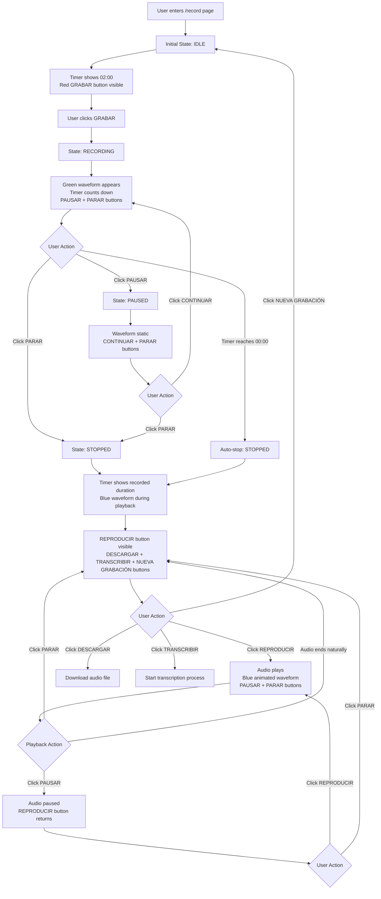

# Voice Recording Flow Documentation

## Overview

This document describes the complete flow and component architecture for the voice recording functionality in the Astro Note Voice AI application.

## Component Architecture

The voice recording feature is built using a modular component architecture with clear separation of concerns:

### Core Components

1. **`VoiceRecorder.tsx`** - Main orchestrator component
2. **`TimerDisplay.tsx`** - Timer display with countdown/duration
3. **`WaveformVisualizer.tsx`** - Real-time waveform during recording
4. **`AudioPlayer.tsx`** - Playback controls with visualizer
5. **`PlaybackVisualizer.tsx`** - Waveform during audio playback

## Recording Flow Diagram



## Detailed State Flow

### 1. Initial State (IDLE)
**Visual Elements:**
- Timer Display: `02:00` (2 minutes)
- Waveform: Static canvas (no animation)
- Controls: Red **GRABAR** button only

**Component State:**
```typescript
state: "idle"
timeLeft: 120 // seconds
audioBlob: null
audioUrl: null
```

### 2. Recording State (RECORDING)
**Triggered by:** User clicks GRABAR button

**Visual Elements:**
- Timer Display: Countdown from `02:00` to `00:00` (red when ≤10 seconds)
- Waveform: Green animated waveform in real-time
- Controls: **PAUSAR** (outline) + **PARAR** (destructive red) buttons

**Technical Process:**
1. Request microphone access via `getUserMedia()`
2. Create `AudioContext` and `AnalyserNode` for visualization
3. Setup `MediaRecorder` with WebM/Opus format
4. Start countdown timer with 1-second intervals
5. Begin real-time waveform animation
6. Auto-stop when timer reaches 0

**Component State:**
```typescript
state: "recording"
timeLeft: 120 → 0 // decreasing
mediaRecorderRef: MediaRecorder instance
analyserRef: AnalyserNode for visualization
```

### 3. Paused State (PAUSED)
**Triggered by:** User clicks PAUSAR during recording

**Visual Elements:**
- Timer Display: Shows remaining time (frozen)
- Waveform: Static (no animation)
- Controls: Green **CONTINUAR** + **PARAR** (destructive red) buttons

**Technical Process:**
1. Pause `MediaRecorder`
2. Stop countdown timer
3. Stop waveform animation
4. Maintain audio context for resumption

### 4. Stopped State (STOPPED)
**Triggered by:** User clicks PARAR, timer reaches 00:00, or auto-stop

**Visual Elements:**
- Timer Display: Shows **recorded duration** (e.g., `01:23`)
- Waveform: Blue animated waveform during playback only
- Controls: **REPRODUCIR** button + action buttons row

**Action Buttons:**
- **DESCARGAR**: Download audio file (.webm)
- **TRANSCRIBIR**: Send to transcription service
- **NUEVA GRABACIÓN**: Reset to IDLE state

**Technical Process:**
1. Stop `MediaRecorder` and create audio blob
2. Generate object URL for playback
3. Cleanup recording resources (microphone, audio context)
4. Calculate and display recorded duration

### 5. Playback State (Playing Audio)
**Triggered by:** User clicks REPRODUCIR

**Visual Elements:**
- Timer Display: Shows recorded duration
- Waveform: Blue animated waveform synchronized with playback
- Controls: **PAUSAR** + **PARAR** buttons for audio control

**Technical Process:**
1. Create `HTMLAudioElement` from audio URL
2. Setup separate `AudioContext` for playback visualization
3. Connect audio element to analyser for waveform
4. Animate blue waveform during playback

**Playback Sub-states:**
- **Playing**: Blue waveform animating, PAUSAR + PARAR buttons
- **Paused**: Static waveform, REPRODUCIR button returns
- **Stopped**: Return to main STOPPED state

## Component Responsibilities

### VoiceRecorder (Main Orchestrator)
- Manages overall recording state machine
- Handles microphone access and MediaRecorder setup
- Coordinates between sub-components
- Manages timer logic and auto-stop functionality

### TimerDisplay
- Formats and displays time in MM:SS format
- Changes color to red when ≤10 seconds remaining
- Shows countdown during recording, duration after stopping

### WaveformVisualizer
- Draws real-time green waveform during recording
- Uses `AnalyserNode.getByteTimeDomainData()` for audio analysis
- Animates only when `isRecording` prop is true

### AudioPlayer
- Manages audio playback with HTML5 Audio API
- Includes integrated `PlaybackVisualizer` component
- Handles play/pause/stop states independently

### PlaybackVisualizer
- Draws blue waveform during audio playback
- Creates separate AudioContext for playback analysis
- Connects to audio element via `MediaElementAudioSourceNode`

## State Transitions Summary

```
IDLE → RECORDING → PAUSED → RECORDING (loop)
                ↓
              STOPPED → PLAYBACK → STOPPED (loop)
                ↓
              IDLE (nueva grabación)
```

## Key Features

1. **Auto-stop**: Recording automatically stops at 2-minute limit
2. **Real-time visualization**: Green waveform during recording, blue during playback
3. **Pause/Resume**: Full recording pause/resume functionality
4. **Resource cleanup**: Proper cleanup of audio contexts and media streams
5. **Duration display**: Timer shows countdown during recording, duration after completion
6. **Independent playback**: Separate audio controls for reviewing recorded content

This architecture ensures a smooth, intuitive user experience while maintaining clean separation between recording and playback functionality.
